# SatisTrain Chat

[](https://app.netlify.com/sites/satistrain-chat/deploys)


SatisTrain Chat is an **AI‑powered customer‑service training platform**. It lets agents practice real‑life conversations with simulated customers, get live coaching, and track their growth over time.

🔗 **Live Demo:** [https://satistrain-chat.netlify.app](https://satistrain-chat.netlify.app)

---

\## Table of Contents

1. [Features](#features)
2. [Tech Stack](#tech-stack)
3. [Architecture](#architecture)
4. [Getting Started](#getting-started)
5. [Project Structure](#project-structure)
6. [Deployment](#deployment)
7. [Contributing](#contributing)
8. [License](#license)

---

\## Features

|  Category              |  Highlights                                                                                                               |
| ---------------------- | ------------------------------------------------------------------------------------------------------------------------- |
| **AI Simulation**      | OpenAI GPT‑4 generates realistic customer personas (mood, difficulty, issue, background) and always *initiates* the chat. |
| **Live Coaching**      | Immediate feedback on Empathy, Clarity, Helpfulness, Engagement & Professionalism, plus colour‑coded tips.                |
| **Session Reports**    | Full transcript, KPI timeline, improvement tips, exportable as PDF/CSV.                                                   |
| **Leaderboard**        | Compare performance across the organisation and seasons, earn badges & XP.                                                |
| **History & Replay**   | Browse past sessions with score overlay, or watch an AI best‑practice replay.                                             |
| **Profile Management** | Agents can edit first name, last name and unique handle; avatars supported.                                               |
| **Scenario Designer**  | Create channel‑specific scenarios (Chat · E‑Mail · Social DM).                                                            |
| **Security & Privacy** | OpenAI API key stays in the browser; Supabase enforces Row‑Level Security.                                                |

---

\## Tech Stack

* **Next.js 13.5.1** (App Router)
* **TypeScript 5.2.2**
* **Tailwind CSS 3.3.3** via `tailwind-variants` (CSS‑in‑JS)
* **shadcn/ui** & **Radix UI Primitives**
* **Framer Motion 10.16.16** (animations)
* **Zustand 4.4.7** (state)
* **React Hook Form 7.53.0** + **Zod** (forms & validation)
* **Supabase (PostgreSQL + Realtime + Storage)**
* **OpenAI API** (GPT‑4o, GPT‑4‑turbo‑preview)

---

\## Architecture

```mermaid
flowchart TD
  A[Browser] -- Chat / WS --> B(Next.js API Route)
  B -- Edge Functions --> C[Supabase DB]
  A -- REST --> D[api.openai.com]
  A -- localStorage --> E[OpenAI API Key]
```



* **Client‑side Chat:** Direct call to OpenAI with the user‑provided key.
* **Edge Functions:** Persist transcripts, scores and profiles with low latency.

---

\## Getting Started
\### Prerequisites

* Node >= 18
* A personal **OpenAI API key**
* A **Supabase** project (or use the public demo backend)

\### Installation

```bash
# 1. Clone repository
$ git clone https://github.com/spiral023/satistrain-chat-bolt-nextjs.git
$ cd satistrain-chat-bolt-nextjs

# 2. Install dependencies
$ npm install

# 3. Environment variables
$ cp .env.example .env.local
# Fill in OPENAI_API_KEY, NEXT_PUBLIC_SUPABASE_URL, NEXT_PUBLIC_SUPABASE_ANON_KEY

# 4. Start dev server
$ npm run dev
# Visit http://localhost:3000
```

---

\## Project Structure

```
app/                    # Next.js routes & layouts
├── layout.tsx          # Root layout (Providers, Theme)
├── page.tsx            # Main chat page
components/             # Reusable UI widgets (chat, sidebar, dialogs, shadcn/ui)
hooks/                  # Custom React hooks
lib/                    # Core logic (OpenAI, Supabase, store, utils)
public/                 # Static assets
netlify/                # Netlify edge & functions config
scripts/                # Build & seed helpers
types/                  # Shared TypeScript types
```

(See [PROJECT\_STRUCTURE.md](docs/PROJECT_STRUCTURE.md) for details.)

---

\## Deployment
This repository ships with a ready‑to‑use **Netlify** configuration (`netlify.toml`).
1. Push your fork to GitHub.
2. Create a new site in Netlify, connect the repo, set env vars.
3. Build command: `npm run build`, Publish directory: `.next`.

Optionally deploy on **Vercel** – the app runs on edge‑compatible APIs.

---

\## Contributing
We welcome issues and pull requests!
1. Fork the repo and create your branch off `main`.
2. Follow Conventional Commits (`feat: ...`, `fix: ...`).
3. Run `npm run test` before pushing.
4. Open a Pull Request – the CI checks formatting & tests.

---

\## License

Distributed under the **MIT License**. See [`LICENSE`](LICENSE) for full text.
